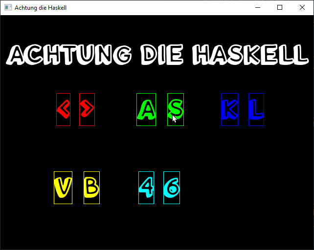
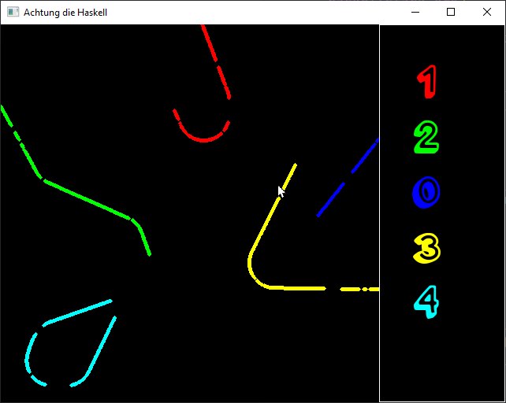
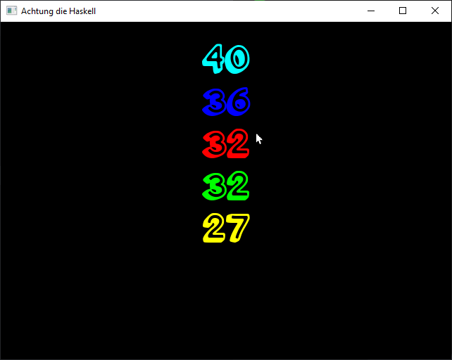

# Achtung die Haskell

Achtung die Haskell is an [Achtung, die Kurve!](https://en.wikipedia.org/wiki/Achtung,_die_Kurve!) clone written in Haskell, using Apecs and SDL2.

## Installation (on Windows)

This project was built using [Stack](https://www.haskellstack.org).

Install SDL2 via Stack & Pacman

```bash
stack exec -- pacman -Syu
stack exec -- pacman -S mingw-w64-x86_64-pkg-config mingw-w64-x86_64-SDL2
```

Install [ghcid](https://hackage.haskell.org/package/ghcid) and run it from the repository root

```bash
stack install ghcid
ghcid
```

This is running an interpreted version of the game that updates as code is updated. I developed the game in this "hot reload" environment. Feel free to try changing things.

It is also possible to build the game and run it, but you'd have to move all the files to their appropriate location to run it.

## Usage

These are the instructions for playing the game

### Menu screen
Press the keys matching the controls displayed on the screen to add or remove a player from the game. The game needs at least 2 players. Then press `[SPACE]` to start the game.



### Game screen
Each round starts paused. It shows each player as their color as a dot designating their starting position. Press `[SPACE]` to start.

Use the controls in shown in the previous menu to rotate your running line to right or left. A player loses the round when colliding with a line or the borders of the game area. 

Players play to `(n - 1) * 10` points where `n` is the number of players. It is possible to pass through spaces that occur randomly in other players lines. A round ends when there is one or less remaining players.

Each round ends paused. Press `[SPACE]` to go to the next round. If the match is over, then pressing `[SPACE]` moves you to the end screen.



### End screen
Press space to go back to the menu screen



## Contributing
This project is considered done, but I will look over any contributions made to the project if there are any bugs.

## License
See [LICENSE](./LICENSE).